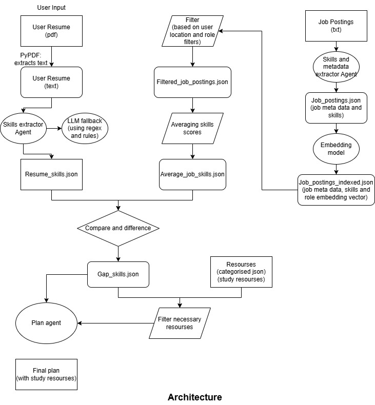

# job_skill

Pipeline to extract skills from a resume + job postings, compute a job-skill average after filtering, calculate skill gaps, and generate a resource-backed learning plan.

- Design/architecture: [docs/DESIGN.md](docs/DESIGN.md)
- Demo video link: https://youtu.be/_86U5_bmIKc
- Main scripts live in `scripts/`
- A run.sh is also provided.

## Quick start

### 1) Install deps

`pip install -r requirements.txt`

### 2) Configure API keys

Create/update `.env`:

- `OPENROUTER_API_KEY=...`

### 3) Run the pipeline
Run:
- `python run.sh` 
to run the entire pipeline. This will run all the scripts in order.
If you want to run each script seperately then follow:

1. Extract resume skills:
   - `python scripts/extract_resume_skills.py --use-llm`

2. Extract job postings to JSON (if not already):
   - `python scripts/process_job_postings.py extract`

3. Add role embeddings to each job JSON + rebuild combined index:
   - `python scripts/embed_job_postings_and_rebuild_index.py`

4. Filter jobs + generate average job skills:
   - `python scripts/filter_jobs_and_average.py`

5. Generate gap skills JSON:
   - `python scripts/generate_gap_skills.py`

6. Generate gap summary + filtered resources + learning plan:
   - `python scripts/report_generate.py`

### Architecture Diagram:

